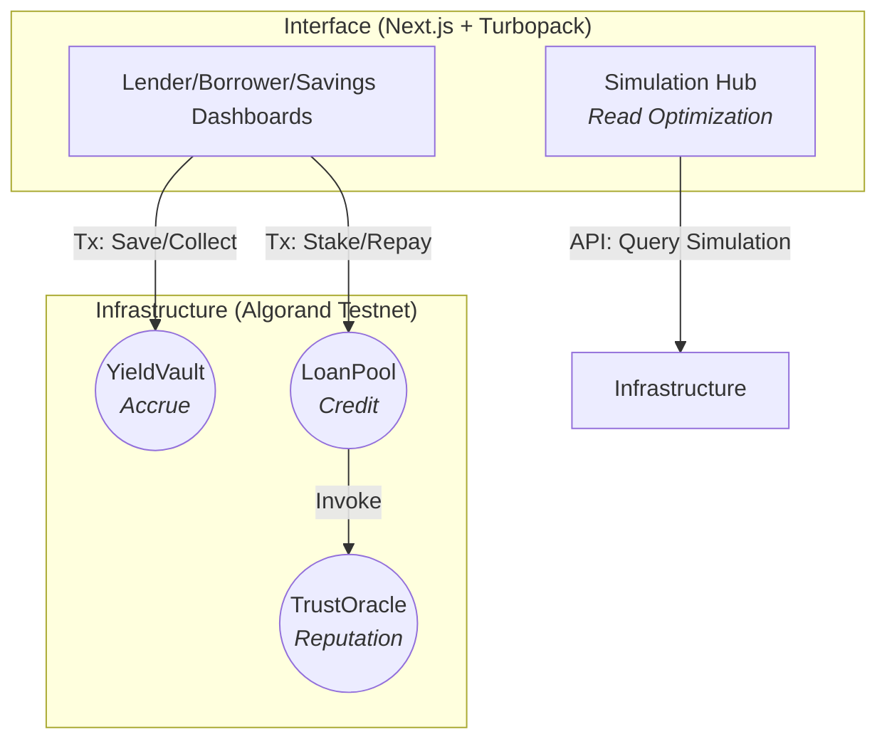

# SakhiLend + DigiSavings

SakhiLend + DigiSavings is a dual-sided financial inclusion protocol built on the **Algorand Testnet**. It bridges global liquidity with local micro-entrepreneurs in the Mann Deshi ecosystem.

## 🏗️ Architecture Matrix



---

### 🌐 [SakhiLend](https://orange-passive-rabbit-244.mypinata.cloud/ipfs/bafkreib2q4lf3xd5thzaklkktdnjdyj3hhdf3xaip5mpva4elwrgr5nuy4)
A P2P microlending marketplace where global lenders fund loans to verified Mann Deshi borrowers. 
- **Verifiable Impact**: Loans are disbursed in **Sakhi USDC** (Asset: `758817439`) via smart contracts.
- **On-Chain Credit**: Borrower TTF-scores are recorded in a decentralized Oracle.
- **Pooled Funding**: Lenders can co-fund Sakhi businesses with automated yield tracking.

### 💰 [DigiSavings](https://orange-passive-rabbit-244.mypinata.cloud/ipfs/bafkreib2q4lf3xd5thzaklkktdnjdyj3hhdf3xaip5mpva4elwrgr5nuy4)
A UPI-linked yield savings simulator for rural communities.
- **Simplicity First**: Users save in INR; system handles automated USDC conversion on-chain.
- **Relatable Growth**: Earnings are presented in local context: *"Aaj aapne ₹3.20 kamaye — ek chai ki kimat."*
- **Instant Liquidity**: High-yield savings with no lock-up period.

---

## ⚡ Production Infrastructure
- **YieldVault**: Handles compound interest and asset security.
- **LoanPool**: Manages the lending lifecycle with administrative oversight.
- **Simulation Hub**: Advanced `lib/algorand/client` enables real-time balance sync with **ZERO wallet signatures** for read operations.
- **Testnet Ready**: Fully deployed and synchronized with `https://testnet-api.algonode.cloud`.

---

## 🚀 Getting Started
```bash
# 1. Install dependencies
npm install

# 2. Configure Environment
cp .env.example .env.local

# 3. Build for Production
npm run build

# 4. Start Local Dev
npm run dev
```

---

## 🏗 Tech Stack
- **Frontend**: Next.js 16 (Turbopack), Tailwind CSS v4, Radix UI.
- **Smart Contracts**: Puya TS (Algokit Ecosystem).
- **Security**: Wallet integration via `@txnlab/use-wallet-react`.
- **Backend**: MongoDB (Narrative storage) + Algorand Indexer (Financial storage).
